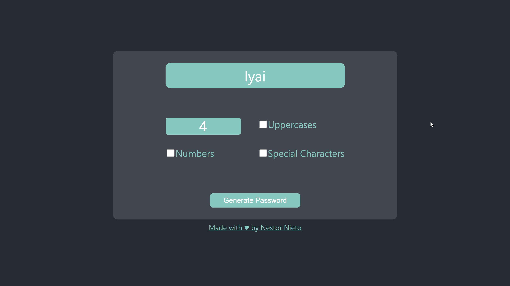

# Password Generator 🔐

## Demo video 🎥

## Live code 🧬
The web app is hosted in GitHub Pages; you can see it 👉 [Here](https://nnieto25.github.io/Password-Generator/) 👈.

## Core features 💻
* Password length range: [4, 32].
* Responsive design.
* Input validation.
* Copy to clipboard on click.

